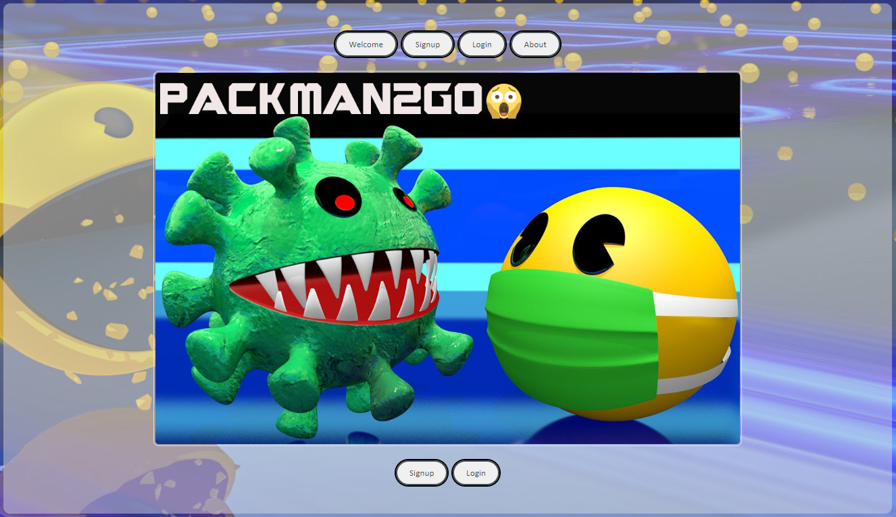
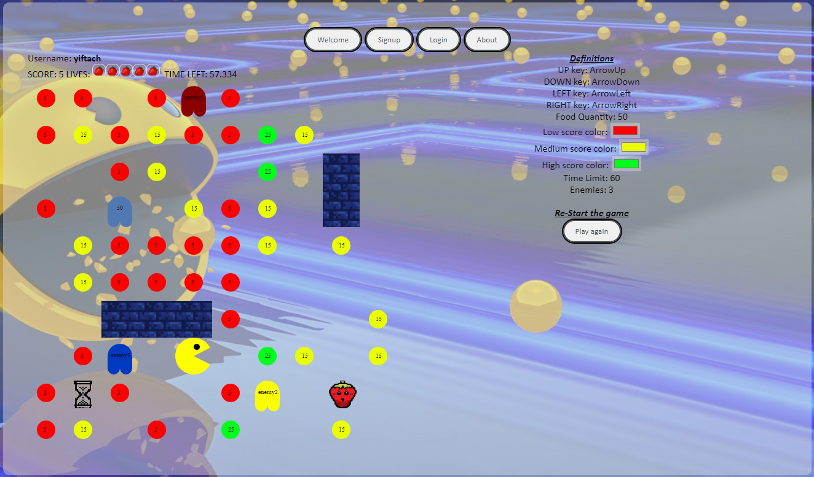

# Web-Development-Environments-Pacman

 

This repository includes a Pacman web game developed as part of the Web Development Environments course at the Ben-Gurion University of the Negev. 

The course deals with environments, developing tools and technologies for Web design and Programming. Topics that were covered include: Survey of **advanced search tools in the Web**; **Principles of Scripting languages**, **Java Script** and **Visual Studio Code**; tools and methods for designing Internet sites (e.g. Nielsen's approach); methods for Internet sites evaluation; **HTML advanced Editor**; **Cascading Style Sheets (CSS)**; SGML standard and XML language; Management of HTTP servers; Documents Object Model (DOM); Implementation of java Applets in HTML & Dynamic HTML; Server side programming and Client side programming; connection with legacy systems.

## Pacman game | [Game Website Link](https://sise-web-development-environments.github.io/assignment2-merav-yiftach/)

  
  

Yiftach Savransky | Merav Shaked

We implemented a version of the classic Pacman game.
This game was developed as a **Singe Page Application** that runs only on one HTML page (html.index) with a few Divs. we used HTML5 canvas, CSS, and Java Script. We used jQuery Plugin to validate the user's input, sign up and sign in. Some features have been added, such as choice of colors, number of monsters, controls keys, pallets quantety, and time limit. 

Additional functionalities added:
1.	**Medicine** – adds one more life.  
2.	**Clock** – adds 25%  of the original time limit to the timer.   

  
  

